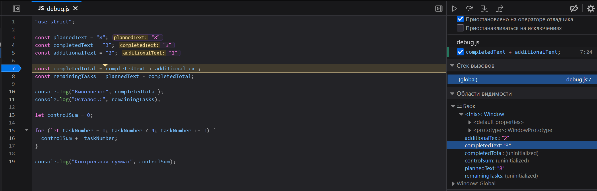

# Практическая работа № 1

## Автор: 

Имя: Дружинин Илья
Группа: ЭФБО-05-25

## Вариант 8

## Окружение:

- ОС: Windows 11 version 25H2
- Node.js: v24.21.0
- Git: version 2.55.0.windows.5
- Браузер: Fierfox Версия 155.0.1 (64-разрядная)

## Запуск:

JavaScript-файлы запускались через Node.js из терминала Visual Studio Code.

Использовались следующие команды из корня репозитория:

node practice-01/js/hello.js
node practice-01/js/types.js
node practice-01/js/progress.js
node practice-01/js/plan.js
node practice-01/js/debug.js

В результате выполнения каждой команды в терминале отображался соответствующий вывод программы. При проверке заданий результаты работы программ сравнивались с ожидаемыми значениями.

Также выполнялся запуск через браузер. Для этого открывался файл practice-01/index.html, в котором в теге <script> указывался необходимый JavaScript-файл. Результат выполнения программы просматривался во вкладке Console инструментов разработчика браузера.

## Задание 1: 

Вывод в консоли:

Студент: Дружинин Илья
Группа: ЭФБО-05-25
Практическая работа: 1
JavaScript успешно запущен
Тип document: undefined

Вывод в браузере:

Студент: Дружинин Илья
Группа: ЭФБО-05-25
Практическая работа: 1
JavaScript успешно запущен
Тип document: object

## Задание 2:

| № | Выражение | Ожидание до запуска | Фактическое значение | Тип результата | Объяснение |
|---|---|---|---|---|---|
| 1 | `"8" + 2` | `"82"` | `"82"` | `string` | `Добавление к строке` |
| 2 | `"8" - 2` | `6` | `6` | `number` | `"8" ` |
| 3 | `Number("8") + 2` | `10` | `10` | `number` | `Number() переводит строку в число` |
| 4 | `"12" > "3"` | `false` | `false` | `boolean` | Сравнение строк выполняется лексикографически |
| 5 | `12 === "12"` | `false` | `false` | `boolean` | `Разные типы данных` |
| 6 | `Number("")` | `0` | `0` | `number` | `Пустое значение возвращает 0` |
| 7 | `Number("text")` | `NaN` | `NaN` | `number` | `Функция принимает только string числа` |
| 8 | `Boolean("false")` | `true` | `true` | `boolean` | `Строка не пустая` |
| 9 | `typeof null` | `"object"` | `"object"` | `string` | `typeof null` исторически возвращает `"object"` |
| 10 | `typeof NaN` | `"number"` | `"number"` | `string` | `NaN` имеет тип `number` |

## Задание 3:

| Проверка | Входные данные | Ожидаемый результат | Фактический результат | Итог |
|---|---|---|---|---|
| Обычный случай | `12` `5` | `Осталось 7; прогресс 41.7%; статус «В работе»` | `Осталось: 7; Прогресс: 41.7% Статус: В работе` | Пройдено |
| Граничный случай | `1000` `6` | `Осталось: 994; Прогресс: 0.6% Статус: «В работе»` | `Осталось: 994; Прогресс: 0.6% Статус: «В работе»` | Пройдено |
| Некорректные данные | `5` `2.5` | `Ошибка: дробное количество` | `Ошибка: дробное количество` | Пройдено |

## Задание 4:

| Проверка | Входные данные | Ожидаемый результат | Фактический результат | Итог |
|---|---|---|---|---|
| Обычный случай | `14` `4` `4` | `3 дня; в последний день выполнена 2 задачи` | `День 3: выполнено 2; Потребуется дней: 3` | Пройдено |
| Граничный случай | `1000` `30` `90` | `11 дней; в последний день выполнено 70 задач` | `День 11: выполнено 70; Потребуется дней: 11` | Пройдено |
| Некорректные данные | `5` `2` `0` | `Ошибка: цикл не запускается` | `Ошибка: дневная норма должна быть от 1 до 1000` | Пройдено |

## Отладка:

Фактический вывод исходной программы:

Выполнено: 32
Осталось: -24
Контрольная сумма: 6

| Ошибка | Что наблюдается | Причина | Исправление | Результат после исправления |
|---|---|---|---|---|
| Обработка количества задач | `completedTotal = "32"` | `Сложение строк, а не чисел` | `Использовать Number()` | `Выполнено: 5; Осталось: 3` |
| Граница цикла | `controlSum = 6` | `Условие < 4 исключает 4` | `Заменить "<" на "<=" ` | `Контрольная сумма: 10` |

Фактический вывод исправленной программы:

Выполнено: 5
Осталось: 3
Контрольная сумма: 10

## Дополнительное задание

Вариант А

В дополнительном задании реализована обработка входных данных, поступающих в виде строк. Перед преобразованием проверяется тип данных, удаляются пробелы с помощью `trim()`, отклоняется пустой ввод, после чего выполняется преобразование через `Number()` и проверка ограничений задания 3.

Проверены обычные строки, строки с пробелами, пустой ввод, `"abc"`, `"2.5"`, `"Infinity"`, `null` и `undefined`.

Простого преобразования через `Number()` и проверки на отрицательное значение недостаточно, так как результатом могут быть `NaN`, `Infinity`, `0` для пустой строки или дробное число. Поэтому после преобразования выполняются дополнительные проверки корректности значения.

| Входные данные | Результат |
|---|---|
| `"12"`, `"5"` | Корректно: осталось 7 |
| `" 12 "`, `" 5 "` | Корректно после `trim()` |
| `""`, `"5"` | Ошибка: пустой ввод |
| `"   "`, `"5"` | Ошибка: пустой ввод |
| `"abc"`, `"5"` | Ошибка: недопустимое числовое значение | 
| `"2.5"`, `"5"` | Ошибка: дробное количество |
| `"Infinity"`, `"5"` | Ошибка: число должно быть конечным |
| `null`, `"5"` | Ошибка: данные должны быть строками |
| `undefined`, `"5"` | Ошибка: данные должны быть строками |

## Вывод

В ходе практической работы были освоены основы JavaScript: запуск программ через Node.js и браузер, работа с переменными и типами данных, условными конструкциями и циклами. Были выполнены проверки корректности входных данных и проведена отладка программы с помощью DevTools.

Наиболее показательной оказалась ошибка при сложении строк: значения `"3"` и `"2"` без преобразования складывались как строки и давали `"32"` вместо `5`. В процессе отладки была выявлена причина ошибки и выполнено преобразование строк в числа с помощью `Number()`.
